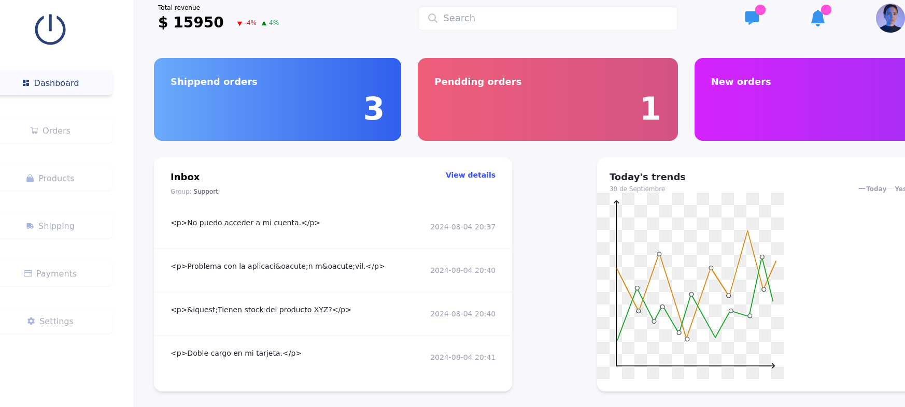
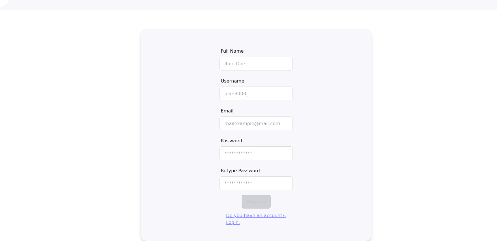
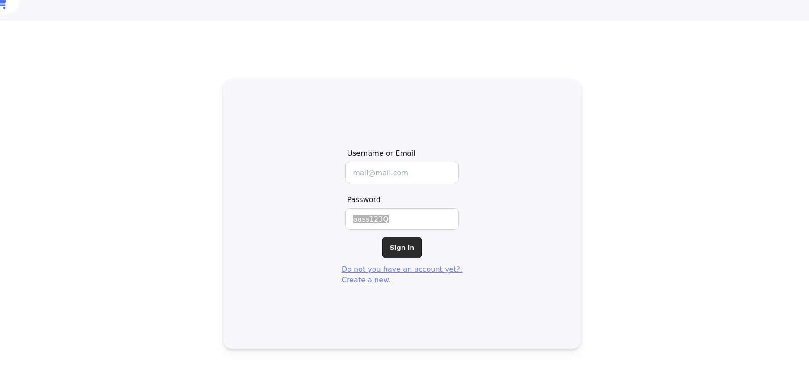

# Proyecto de Validación de Habilidades con React, Redux, React Router y Vite

Este proyecto tiene como objetivo validar y demostrar mis habilidades en el uso de las tecnologías React, Redux, React Router y Vite. Es un proyecto pequeño pero abarcativo, que busca cubrir diferentes aspectos del desarrollo frontend moderno.

## Requisitos Previos

Asegúrate de tener instalados los siguientes programas en tu máquina antes de comenzar:

- Node.js (versión 14 o superior)
- npm (versión 6 o superior) o yarn (opcional)

## Instalación

1. **Clonar el repositorio:**

   ```bash
   git clone https://github.com/enderNT/ecommerce-dashboard/tree/main
   cd tu-proyecto
   ```

2. **Instalar dependencias:**

   Usando npm:
   ```bash
   npm install
   ```

   Usando yarn:
   ```bash
   yarn install
   ```

## Ejecución en Modo Desarrollo

Para levantar el proyecto en modo desarrollo, usa el siguiente comando:

Usando npm:
```bash
npm run dev
```

Usando yarn:
```bash
yarn dev
```

Este comando iniciará el servidor de desarrollo de Vite y podrás acceder a la aplicación desde tu navegador en la dirección [http://localhost:5173](http://localhost:5173).

## Capturas de Pantalla
Aquí hay algunas capturas de pantalla del proyecto:

### Pantalla Principal (Pagina - dashboard)




## Tecnologías Utilizadas

- **React**: Biblioteca para la construcción de interfaces de usuario.
- **Redux**: Administración del estado global de la aplicación.
- **React Router**: Enrutamiento para la navegación de la aplicación.
- **Vite**: Herramienta de construcción y desarrollo rápida y ligera.

## Contribuciones

Las contribuciones son bienvenidas. Por favor, sigue estos pasos:

1. Haz un fork del proyecto.
2. Crea una nueva rama (`git checkout -b feature/nueva-funcionalidad`).
3. Realiza tus cambios y haz commit (`git commit -am 'Añadir nueva funcionalidad'`).
4. Envía tus cambios (`git push origin feature/nueva-funcionalidad`).
5. Crea un Pull Request.

## Licencia

Este proyecto está licenciado bajo la Licencia MIT. Para más detalles, consulta el archivo [LICENSE](LICENSE).

---

Si tienes alguna pregunta o sugerencia, no dudes en abrir un issue o contactar al autor del proyecto.

¡Gracias por tu interés y contribuciones!